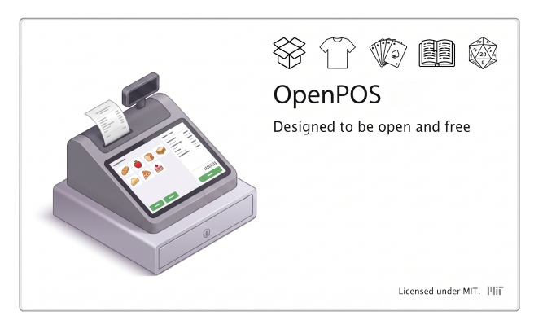

<div align="center">

<h1>Open-POS</h1>

<p>
  
</p>

<p>
  <strong>A modular, fault-tolerant Point of Sale system and management platform<br>
  built for local business data sovereignty, pluggable retail addons, and zero-terminal out-of-the-box operation.</strong>
</p>

<p>
  <a href="https://github.com/Cave404/Open-POS/releases"></a>
  <a href="LICENSE"></a>
  
  
  
</p>

</div>

---

## Architectural Highlights

| Feature | Description |
|---------|-------------|
| **Native Desktop Wrapper** | Clean Windows desktop GUI powered by [pywebview](https://pywebview.flowrl.com/), served via [Waitress](https://docs.pylonsproject.org/projects/waitress/) production WSGI, backed by a [pystray](https://pystray.readthedocs.io/) system tray supervisor. |
| **Isolated Data Sovereignty** | All runtime data, custom uploads, card caches, application logs, and local databases reside in a root-level, git-ignored `data/` directory. Core software updates from GitHub will never overwrite or sync store records. |
| **Bidirectional Database Engine** | First-class support for both SQLite 3 (zero-config standalone register) and PostgreSQL 14+ (high-concurrency network store pool) with automated in-app schema and data migration tools. |
| **Double-Entry Store Credit Ledger** | Financial immutability at the core. Customer credit balances cannot be overwritten directly; every balance shift requires an append-only ledger transaction with source addon identifiers, audit notes, and reference IDs. |
| **Universal Customer Resolver & Ghost Tag Bus** | Resolves customer profiles across 14-character uppercase NFC loyalty badges, formatted phone numbers, emails, or names. Hardware badge binding broadcasts a core event (`customer:badge_assigned`) allowing inventory addons to unbind conflicting physical merchandise tags automatically. |
| **Decentralized Addon Engine** | Extensions and industry-specific workflows (card trading, tournament management, retro buyback) mount dynamically from remote repositories. Failing addon exceptions are isolated so the core register never crashes. |
| **Provisioning & Recovery Wizard** | First-run wizard handles database engine selection, store identity, administrator PIN lockout, Fernet AES-128 encryption key initialization, and generation of a printable/exportable emergency recovery sheet. |

---

## Core System Architecture

```
Open-POS/
├── core/                    # Core business logic, DB engines, and event bus
│   ├── addons/              # Dynamic plugin discovery, installer, and catalog
│   ├── models/              # Customer, Ledger, and core schema definitions
│   ├── services/            # CustomerService, DB Migrator, and Encryption
│   ├── events.py            # In-process pub/sub event dispatcher
│   └── config.py            # Configuration manager and environment loader
│
├── data/                    # LOCAL ONLY — strictly git-ignored
│   ├── config/              # Local .env, encryption secrets, auth hashes
│   ├── custom_addons/       # Remotely installed addon repositories
│   ├── db/                  # Local SQLite database files & backups
│   ├── cache/               # Remote catalog and external API caches
│   ├── uploads/             # Store logos and business branding assets
│   └── logs/                # System traces and rotating diagnostic logs
│
├── manager/                 # System Manager control panel & UI routes
│   ├── templates/           # Manager views, setup wizard, and subviews
│   └── routes.py            # REST endpoints for control panel operations
│
├── migrations/              # Dual SQL migrations (SQLite & PostgreSQL)
├── static/                  # Shared stylesheets, scripts, and branding
│
├── docs/
│   ├── ADDON_SPEC.md        # Core Addon Interface Contract (API v1.0.0)
│   └── WIKI.md              # System engineering guide and lifecycle docs
│
├── Open_POS.vbs             # Silent, terminal-free launcher for cashiers
├── Start_POS.bat            # Bootstrapper (auto-creates venv & installs deps)
└── run.py                   # Unified multi-threaded application runner
```

---

## Quick Start (Windows)

### Cashier / Retail Deployment (OOTB)

1. Download or clone the repository to the local machine.
2. Double-click **`Open_POS.vbs`**.
3. On first boot, the system provisions the virtual environment, verifies prerequisites, and launches the **Setup Wizard**.
4. Follow the prompts to configure store branding, set an optional manager PIN, generate emergency decryption keys, and create a desktop shortcut.

### Developer Setup

```powershell
# Clone the repository
git clone https://github.com/Cave404/Open-POS.git
cd Open-POS

# Create and activate virtual environment
python -m venv venv
.\venv\Scripts\Activate.ps1

# Install required dependencies
pip install -r requirements.txt

# Run the development application
python run.py
```

---

## Database Migration & Switching

OpenPOS can switch database backends at any time without data loss:

| Engine | Ideal Deployment | Features |
|--------|-----------------|----------|
| **SQLite 3** | Single standalone registers, pop-up events, offline setups | Zero maintenance, WAL-mode, portable single-file database in `data/db/`. |
| **PostgreSQL 14+** | Multi-lane retail stores, web catalog sync, concurrent workers | Native connection pooling, CITEXT case-insensitive indexing, and JSONB support. |

To convert an active store between engines, open **System Manager → Maintenance Tools → Database Tools** and run the automated migration tool.

---

## Developing Addons

OpenPOS uses an isolated provider architecture. Addons live in their own repositories and mount into the core via Flask blueprints without altering core schema.

To create an addon compatible with the OpenPOS platform:

1. Review the contract in [`docs/ADDON_SPEC.md`](docs/ADDON_SPEC.md).
2. Create a repository with a root `manifest.json`, `plugin.py`, and dual SQL migration files.
3. Use the core event bus (`core.events.event_bus`) to subscribe to system actions or query the customer ledger via `/api/core/customers/*`.

---

## License & Credits

Distributed under the **MIT License**. See [`LICENSE`](LICENSE) for details.

Upstream dependencies, package licensing audits, and project contributors can be viewed at any time directly inside the System Manager under **Administration → About & Credits**.

---

## AI Disclosure

Portions of the source code in this repository (including logic, route handlers, migration scripts, and test suites) were generated or co-authored with the assistance of AI language models. All AI-assisted code has been reviewed, tested, and accepted by the project maintainers.

**Artwork, splash screens (currently using as a place holder while I commission artists for genuine human work; Sorry), logos, and graphical assets are not AI-generated.** All rights to supplied artwork and imagery are reserved by their respective owners. No AI-generated artwork is included in this project.

---

<div align="center">
  <sub>Open-POS v1.0.9 · MIT License · © 2024–2026 Cave404 & Contributors</sub>
</div>
